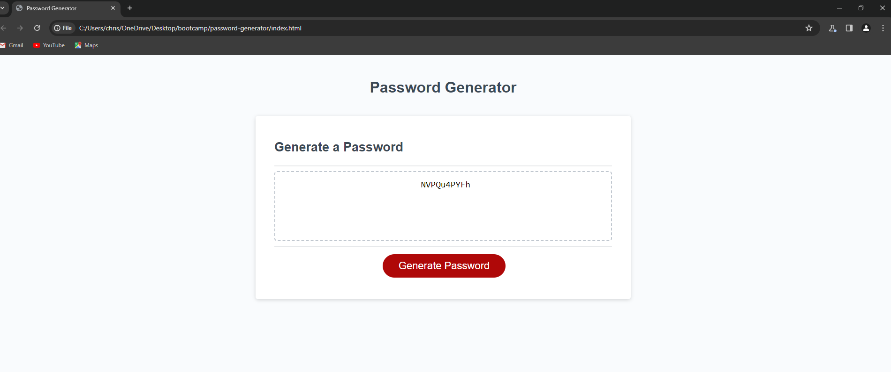

# Password Generator Project:

## Description:

**In this project I added to the JavaScript starter code in order to create a random password generator application that will create unique passwords for users based on the criteria they select. I utilized multiple prompts in order to acquire user input and then created a function that will generate a random password that meets their chosen criteria.**

##  

## [Link to Deployed Application](https://ccarroll929.github.io/password-generator/)

## Installation:

[Visual Studio Code](https://code.visualstudio.com/download)
[Git for Windows](https://gitforwindows.org/)

## Acknowledgments/Credit: [Daniel Vega on YouTube](https://www.youtube.com/@danielvega545)